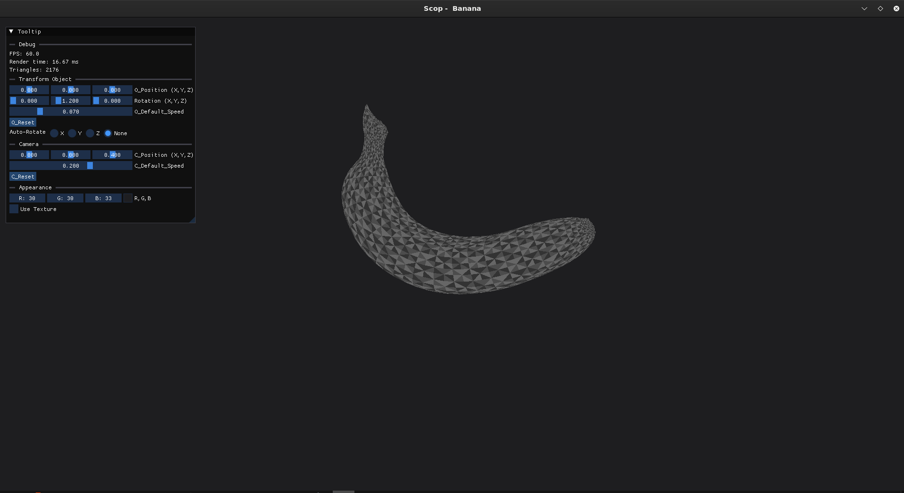
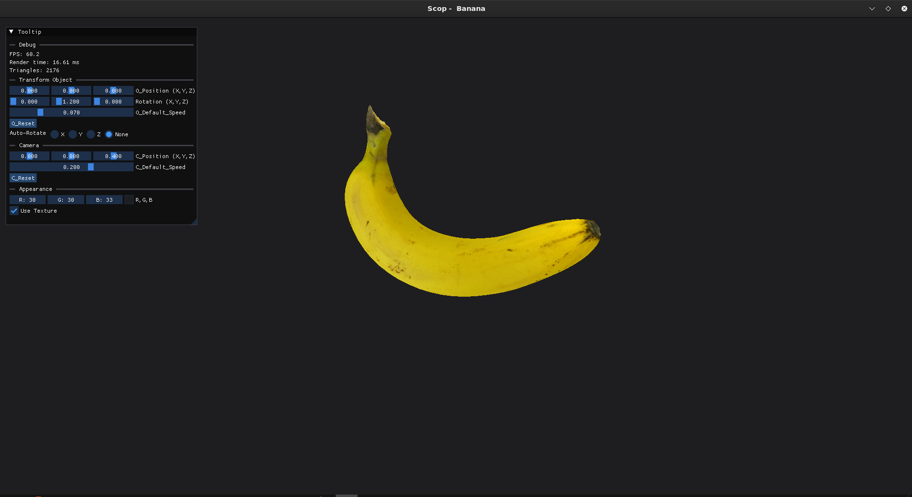

# 🔺 Scop — first step in 3D with GPU

# 📝 introduction

**scop** is a program that takes a *.obj* file to render a 3D object with OpenGL in C++.
The 3D object must rotate around itself, and with a play of colors we can
see different aspects of the object. A texture can be loaded when we press a button, if we press it again, the texture disappears.
The object can move along the three axes in both directions (X,Y,Z).

## ✨ Features

* 📦 **.obj files** can takes all .obj files
* 🎨 **Textures** using *stb_image* to load textures on object
* 🛠️ **Debug Gui** with *ImGui* (show fps, triangles, can change transform of object or camera)
* 🎥 **Camera** basic camera with no rotations
---

## 🏗️ Technical Overview
### 1. 📦 Parse .obj
my programs support :
```v``` -> vertex position ```(x, y, z)```
```vt``` -> textures coordinates ```(u, v)```
```f``` -> faces ```(v/vt/vn)```
```vn``` -> normal (ignored here, no lighting use)

### 2. 🎨 Shaders system
Shaders are loaded from external files, compiled in runtime and linked into a program
* Read shader source from file
* ```glCreateShader```
* ```glCompileShader```
* Error checking with ```glGetShaderInfoLog```
* Link with ```glLinkProgram```
Exemple of shader file :
```
#version 460 core // version

layout(location = 0) in vec3 aPos; // pos of vertex
layout(location = 1) in vec3 aColor; // color of vertex
layout(location = 2) in vec2 aTex; // texture of vertex

//matrices
uniform mat4 uModel;
uniform mat4 uView;
uniform mat4 uProjection;

// return to fragment shader(to render)
out vec3 vertexColor;
out vec2 vertexTex;

void main()
{
	gl_Position = uProjection * uView * uModel * vec4(aPos, 1.0);

	vertexColor = aColor;
	vertexTex = aTex;
}

```

* ```layout(location = x)``` binds VBO attributes (like vertex of triangle)
* ```uniform``` matrices are updates every frame from the CPU (like texture)

### 3. ⚡ Pipeline rendering
Rendering is based on VAO + VBO
* **VAO** -> Vertex Array object (stores wich VBO is used, how to interpret buffer data...)
* **VBO** -> Vertex buffer object (GPU memory buffer that stores vertex data)

### 4. 🛠️ use ImGui
ImGui is pratical for debug when we develloping.
Exemple :
```
ImGui::Begin("Tooltip");
ImGui::SeparatorText("Debug");
ImGui::Text("FPS: %.1f", io.Framerate);
ImGui::Text("Render time: %.2f ms", 1000.0f / io.Framerate);
ImGui::Text("Triangles: %ld", obj.triangleCount);
ImGui::End();
```
This can show us FPS and triangles

## 🚀 Installation

1.  **Clone the project :**
    ```bash
    git clone https://github.com/Nnelo0/scop.git scop
    cd scop
    ```
2.  **Compile :**
    ```bash
    make
    ```
3.  **Run :**
    ```bash
    ./scop <.obj file> [texture file]
    ```
4.  **🎮 Controls :**
```
┌----------------------------------------┐
|                Commands                |
|  Object Movements :                    |
|     - ↑ : Move Forward                 |
|     - ↓ : Move Backward                |
|     - → : Move Right                   |
|     - ← : Move Left                    |
|     - PgUp : Move Up                   |
|     - PgDown : Move Down               |
|     - LEFT_SHIFT : x2 speed            |
|                                        |
|   Camera Movements :                   |
|     - W : Move Forward                 |
|     - A : Move Backward                |
|     - S : Move Right                   |
|     - D : Move Left                    |
|     - Space : Move Up                  |
|     - Left_Ctrl : Move Down            |
|     - LEFT_SHIFT : x2 speed            |
|                                        |
|   Tools :                              |
|     - R : Reset Object                 |
|     - C : Reset Camera                 |
|     - P : Stop auto-rotation           |
|     - TAB : Open Gui                   |
└----------------------------------------┘
```

---

## 🖼️ Exemple

### Without Texture :

### With Texture :


## 📜 Credits & Contributors
- 🎨 **Nnelo** — do all things ([GitHub](https://github.com/Nnelo0)) 
---
